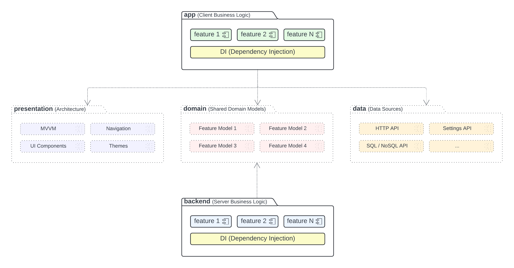
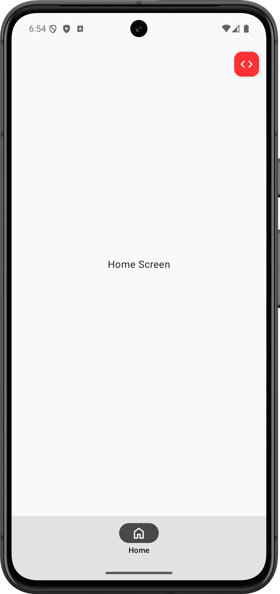
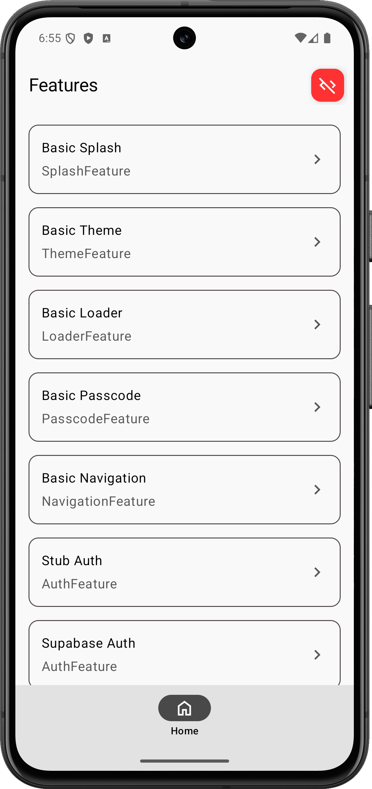
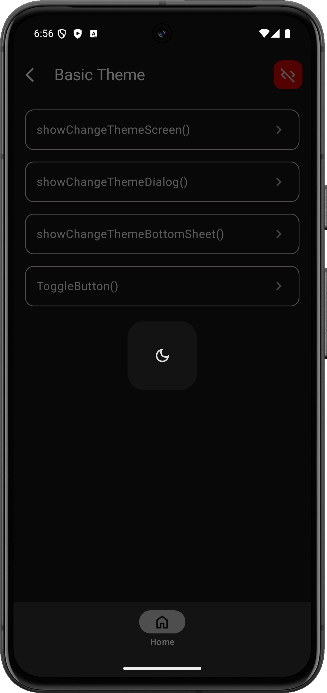

# Compose Multiplatform Fully Configurable Project Template

## Supported Platforms

- Android
- iOS
- Web (JS)
- Desktop (Windows, MacOS, Linux)
- Backend (Ktor Server)
- Backend (Supabase)

```
All target platforms are optional and will be included only if selected during configuration, along with any features.
```

## Table of Contents

- [Overview](#overview)
- [Get started](#get-started)
- [Architecture](#architecture)
- [Documentation](#documentation)
- [Showcases](#showcases)
- [How to use](#how-to-use)
- [Features](#features)

# Overview

The template follows the general principals:

- The underlying architecture is minimalistic, pre-configured, and complies with the latest recommended guidelines.
- Third-party dependencies, components, DevOps practices, and configurations are optional and can be included or excluded through an online service [Kotli](https://kotli.xyz).
- All out-of-the-box solutions work seamlessly across all supported platforms and are designed to accelerate the development of complex and production-ready applications within days, prioritizing simplicity and efficiency during the implementation and support phases.

# Get started

**!IMPORTANT!** The given template is a [Kotli Template](https://kotlitecture.github.io/engine/template_overview).

To generate the required project structure, use online service [Kotli](https://kotli.xyz/project) (it's free and only requires an internet connection).

Once you configure the necessary features and generate the archive with source codes, you'll have a ready-to-use and working project structure that can be imported into your IDE to begin adding the required business logic.

The template will also include all necessary showcases to make understanding of the included features easy.

Run your project to check what is included and how it works, and once everything is clear, remove the package with showcases and any references to it.

# Architecture



## Frontend

The overall client architecture follows [the recommended guidelines](https://developer.android.com/topic/architecture/recommendations) and is built on:
- [Compose Multiplatform UI Framework](https://www.jetbrains.com/lp/compose-multiplatform/)
- [Compose Multiplatform Images and resources](https://www.jetbrains.com/help/kotlin-multiplatform-dev/compose-images-resources.html)
- [Jetpack Compose](https://developer.android.com/develop/ui/compose)
- [Jetpack Navigation](https://developer.android.com/guide/navigation)
- [Jetpack Lifecycle](https://developer.android.com/topic/libraries/architecture/lifecycle)
- [Jetpack ViewModel](https://developer.android.com/topic/libraries/architecture/viewmodel)
- [Material 3 Design](https://m3.material.io)
- [Koin Dependency Injection](https://insert-koin.io)

Application logic is implemented in the `app` module and contains only app-specific behavior.

All common logic is part of the shared group, which is split into three modules:

- **presentation** - [Presentation Layer](https://developer.android.com/topic/architecture/ui-layer).
- **data** - [Data Layer](https://developer.android.com/topic/architecture/data-layer).
- **domain** - [Domain Layer](https://developer.android.com/topic/architecture/domain-layer).

These modules are used only at the app level. This approach lets you develop all three components independently and create a more complex app structure. For example, app-specific features can be implemented as separate modules, having the same shared dependencies.

### Module - presentation

Provides architectural solutions and design system of the app to implement user flows and integrate all components with each other in a lifecycle-aware manner.

It includes:

- **MVVM pattern implementation** - based on the [Jetpack ViewModel](https://developer.android.com/topic/libraries/architecture/viewmodel) and [Jetpack Lifecycle](https://developer.android.com/topic/libraries/architecture/lifecycle) components.
- **Navigation integration** - based on the [Jetpack Navigation](https://developer.android.com/guide/navigation) component.
- **UI Components** - [Design System](https://en.m.wikipedia.org/wiki/Design_system) of the entire app based on the [Google Material 3 Design](https://m3.material.io).

The included solutions are not mandatory to follow, as all required dependencies are properly included to enable you to use your own patterns with Jetpack components.

However, the provided implementations are very intuitive to use and cover all possible cases of communication between components in various real-life scenarios.

Feel free to choose what fits your needs best.

### Module - data

Provides a fundamental implementation of commonly used data sources. During project setup via [Kotli](https://kotli.xyz), only the required data sources will be included.

All data sources have been configured to access the necessary data layer in a flexible and convenient manner.

### Module - domain

Encapsulates core business logic and shared data models (Use Cases) that are reusable across all feature-specific modules of the app.
This layer serves as the backbone for handling business rules, decoupling feature modules from one another while maintaining consistency and scalability.

### Module - app

The Application module itself contains:

- Logic to properly connect all included components together with the help of Dependency Injection (Koin, by default).
- Showcases to demonstrate some features included during [project setup](https://kotli.xyz/project).

Once you download and import the initial project structure into your IDE, the project is ready to run on a device, enabling you to understand the included functionality and start adding the required features.

## Backend

The server architecture is based on either the [Ktor Framework](https://ktor.io) or [Spring Boot](https://spring.io/projects/spring-boot) or any other possible solution.

# Documentation

Once you've configured your project through [Kotli](https://kotli.xyz/project) and downloaded the generated source codes, this project become fully yours and is not bound to the service. Each project includes a README.MD file in its root with the following helpful details:

- A link to the initial template used to prepare the project structure (GitHub page of the template, similar to this one).
- A link to the architecture ([Kotli](https://kotli.xyz/project) project) used to prepare and download these sources.
- A list of all features included in the project during its [setup](https://kotli.xyz/project). Each feature includes additional documentation within the project's `docs` directory, making it easy to check what is included, find official links, and understand how to use and configure each functionality if needed.

All documentation related to features can also be found and accessed online, up-to-date, once you open the link to your Kotli project.

# Showcases

When a project is configured and downloaded via [Kotli](https://kotli.xyz/project), it also provides showcases of all included features. Furthermore, the screen with showcases is configured as the initial screen when running the downloaded template.

|            Home Screen             |          Features Screen           |          Basic Theme API           |        Basic Navigation API        |
|:----------------------------------:|:----------------------------------:|:----------------------------------:|:----------------------------------:|
|  |  |  |  |

# How to use

Once the project is downloaded, it includes the source code as well as a **README.md** file. This file visualizes all the features included as a table. The most useful columns in this table are:

- **Overview** - A summary of the feature, including all official resources used to pre-configure this feature in the template. Use it as a reference to find any additional information related to the feature.
- **Usage** - The main information related to using the feature. Use it as a starting point when you need to start working with the feature and don't know how to begin.

For example, if you configured the project with **Web** and **iOS** platforms but don't know how to run the app on them (💀), find these platforms in the table and open their **Usage** guide.

# Features

The template is highly configurable, allowing you to include only the necessary features in the app.

All these features are optional, will be updated over time, and can be included in the generated structure during [project setup](https://kotli.xyz).

The generated project will include a similar table in its README.MD file, but with only the configured features (direct and transitive).

| Group | Feature | Overview | Configuration | Usage |
|-------|---------|----------|---------------|-------|
| Platforms | Android | [Link](docs/Platforms/Android/overview.md) | - | [Link](docs/Platforms/Android/usage.md) |
| Platforms | iOS | [Link](docs/Platforms/iOS/overview.md) | - | [Link](docs/Platforms/iOS/usage.md) |
| Platforms | Desktop | [Link](docs/Platforms/Desktop/overview.md) | - | [Link](docs/Platforms/Desktop/usage.md) |
| Platforms | Web (JS) | [Link](docs/Platforms/Web%20%28JS%29/overview.md) | - | [Link](docs/Platforms/Web%20%28JS%29/usage.md) |
| Platforms | Ktor | [Link](docs/Platforms/Ktor/overview.md) | - | [Link](docs/Platforms/Ktor/usage.md) |
| Platforms | Supabase | [Link](docs/Platforms/Supabase/overview.md) | - | [Link](docs/Platforms/Supabase/usage.md) |
| Dev Tools | Compose Hot Reload | [Link](docs/Dev%20Tools/Compose%20Hot%20Reload/overview.md) | - | [Link](docs/Dev%20Tools/Compose%20Hot%20Reload/usage.md) |
| Dev Tools | kotlin-logging | [Link](docs/Dev%20Tools/kotlin-logging/overview.md) | - | [Link](docs/Dev%20Tools/kotlin-logging/usage.md) |
| Dev Tools | Kermit | [Link](docs/Dev%20Tools/Kermit/overview.md) | - | [Link](docs/Dev%20Tools/Kermit/usage.md) |
| Dev Tools | Napier | [Link](docs/Dev%20Tools/Napier/overview.md) | - | [Link](docs/Dev%20Tools/Napier/usage.md) |
| Data Layer | Ktor HTTP Client | [Link](docs/Data%20Layer/Ktor%20HTTP%20Client/overview.md) | - | [Link](docs/Data%20Layer/Ktor%20HTTP%20Client/usage.md) |
| Data Layer | Multiplatform Settings | [Link](docs/Data%20Layer/Multiplatform%20Settings/overview.md) | - | [Link](docs/Data%20Layer/Multiplatform%20Settings/usage.md) |
| Data Layer | Korlibs Crypto Library | [Link](docs/Data%20Layer/Korlibs%20Crypto%20Library/overview.md) | - | [Link](docs/Data%20Layer/Korlibs%20Crypto%20Library/usage.md) |
| Data Layer | Basic Cache API | [Link](docs/Data%20Layer/Basic%20Cache%20API/overview.md) | - | [Link](docs/Data%20Layer/Basic%20Cache%20API/usage.md) |
| Data Layer | Basic Config API | [Link](docs/Data%20Layer/Basic%20Config%20API/overview.md) | - | [Link](docs/Data%20Layer/Basic%20Config%20API/usage.md) |
| Data Layer | SQLDelight | [Link](docs/Data%20Layer/SQLDelight/overview.md) | - | [Link](docs/Data%20Layer/SQLDelight/usage.md) |
| Data Layer | SQLite (Jetpack Room) | [Link](docs/Data%20Layer/SQLite%20%28Jetpack%20Room%29/overview.md) | - | [Link](docs/Data%20Layer/SQLite%20%28Jetpack%20Room%29/usage.md) |
| Data Layer | Multiplatform Paging Library | [Link](docs/Data%20Layer/Multiplatform%20Paging%20Library/overview.md) | - | [Link](docs/Data%20Layer/Multiplatform%20Paging%20Library/usage.md) |
| Data Layer | Basic Analytics API | [Link](docs/Data%20Layer/Basic%20Analytics%20API/overview.md) | - | [Link](docs/Data%20Layer/Basic%20Analytics%20API/usage.md) |
| Data Layer | Gemini AI | [Link](docs/Data%20Layer/Gemini%20AI/overview.md) | - | [Link](docs/Data%20Layer/Gemini%20AI/usage.md) |
| UI Layer | Coil Image Library | [Link](docs/UI%20Layer/Coil%20Image%20Library/overview.md) | - | [Link](docs/UI%20Layer/Coil%20Image%20Library/usage.md) |
| UI Layer | Markdown Text Renderer | [Link](docs/UI%20Layer/Markdown%20Text%20Renderer/overview.md) | - | [Link](docs/UI%20Layer/Markdown%20Text%20Renderer/usage.md) |
| UI Layer | FileKit | [Link](docs/UI%20Layer/FileKit/overview.md) | - | [Link](docs/UI%20Layer/FileKit/usage.md) |
| User Features | Stub Auth | [Link](docs/User%20Features/Stub%20Auth/overview.md) | - | [Link](docs/User%20Features/Stub%20Auth/usage.md) |
| User Features | Supabase Auth | [Link](docs/User%20Features/Supabase%20Auth/overview.md) | - | [Link](docs/User%20Features/Supabase%20Auth/usage.md) |
| User Features | Basic Loader | [Link](docs/User%20Features/Basic%20Loader/overview.md) | - | [Link](docs/User%20Features/Basic%20Loader/usage.md) |
| User Features | Basic Navigation | [Link](docs/User%20Features/Basic%20Navigation/overview.md) | - | [Link](docs/User%20Features/Basic%20Navigation/usage.md) |
| User Features | Basic Passcode | [Link](docs/User%20Features/Basic%20Passcode/overview.md) | - | [Link](docs/User%20Features/Basic%20Passcode/usage.md) |
| User Features | Basic Splash | [Link](docs/User%20Features/Basic%20Splash/overview.md) | - | [Link](docs/User%20Features/Basic%20Splash/usage.md) |
| User Features | Basic Theme | [Link](docs/User%20Features/Basic%20Theme/overview.md) | - | [Link](docs/User%20Features/Basic%20Theme/usage.md) |